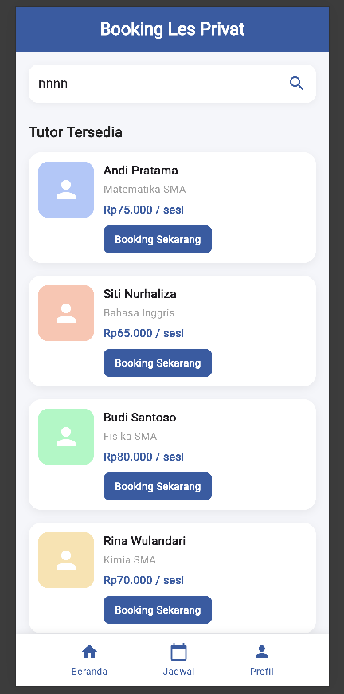

# Booking Les Privat

Aplikasi mobile berbasis Flutter untuk mencari dan memesan tutor les privat sesuai mata pelajaran yang dibutuhkan. Project ini dikembangkan secara bertahap sebagai tugas praktikum mata kuliah Pemrograman Piranti Bergerak, Program Studi Informatika, Universitas Mulawarman.

## Tampilan Aplikasi



## Progres Pengembangan

| Posttest | Materi | Yang Dikerjakan | Status |
|---|---|---|---|
| Posttest 1 | Widget Dasar | Halaman beranda: pencarian, daftar tutor, navigasi bawah | Selesai |
| Posttest 2 | Widget Lanjutan dan Navigation | Foto tutor, halaman detail dan booking | Direncanakan |

## Fitur Saat Ini

- Kolom pencarian tutor atau mata pelajaran
- Daftar tutor berisi nama, mata pelajaran, harga per sesi, dan tombol booking
- Menu navigasi bawah: Beranda, Jadwal, dan Profil

Data tutor masih berupa data contoh dan tampilan masih bersifat statis.

## Widget yang Digunakan (Posttest 1)

MaterialApp, Scaffold, SafeArea, SingleChildScrollView, Padding, Column, Row, Container, SizedBox, Text, Icon, TextField, dan Expanded. Setiap penggunaan widget diberi komentar di dalam kode.

## Rencana Pengembangan

Selain pemesanan tutor, aplikasi ini direncanakan memiliki fitur presensi sesi les. Alurnya dimulai dari pemesanan tutor, penjadwalan sesi, pencatatan kehadiran, hingga rekap riwayat belajar siswa.

## Cara Menjalankan

```bash
flutter pub get
flutter run -d chrome
```

## Pengembang

Rahmat Riyadi (2409106074)
Informatika, Universitas Mulawarman